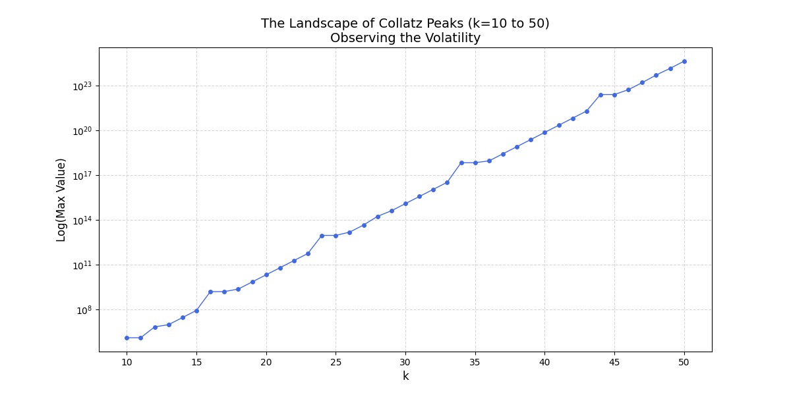
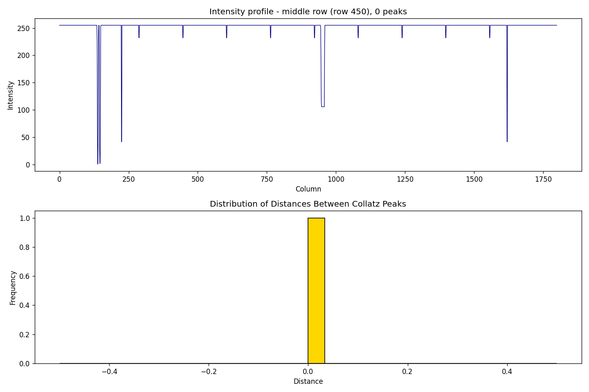

# Collatz-Scaling-Research
# Collatz Conjecture: Scaling Law Analysis

This repository documents my research and computational experiments regarding the Collatz conjecture, focusing on scaling laws observed in peak distances.

## Project Overview
The primary goal of this project is to analyze the statistical behavior of the Collatz sequence. Using Python, I have simulated sequences up to N=200,000 to identify emerging patterns in peak heights and their growth ratios.

## Key Visualizations

### 1. Landscape Analysis

*Observation of sequence paths.*

### 2. Peak Distance Law

*Analysis showing strong correlation (R² ≈ 0.999) in scaling behavior.*

## Methodology
- **Tooling:** Python (NumPy, Matplotlib)
- **Approach:** Empirical data generation followed by regression analysis on peak-distance distributions.

---
*Maintained by Arshia Mansoubi - 8th Grade Student, Damghan, Iran.*
